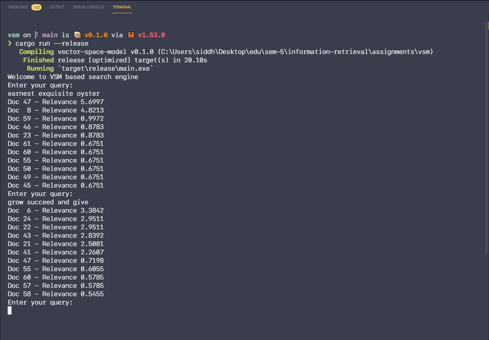

# vector-space-model

This project is a [rust](https://rustlang.org) implementation of vector-space-model for information retrieval.

## Corpus

I have used the book Pride and Prejudice by Jane Austen as the corpus and each chapter (off the total 61) make up a single document, hence there are 61 documents.

The documents are stored in  [data/documents/](./data/documents/) directory.

## Running the program

You'll need the rust-toolchain installed on your system to run the project, if you don't want to setup the rust development environment, you can use [gitpod](https://gitpod.io/#https://github.com/siddharthborderwala/vector-space-model-rs) to open and run this project in the browser.

To run in the production mode (will produce optimized code but take longer compilation time), run -

```sh
cargo run --release
```

To run in the dev mode (will produce un-optimized code but take shorter compilation time), run -

```sh
cargo run
```

## Implementation of Document Vectors as Dimension Maps

There is an issue with the default implementation of VSM, the vectors may have a lot of dimensions with a value of zero, resulting in something like a sparse matrix.

Hence, to save memory, I have used dimension map instead of vectors. I have used a `HashMap<i32, PostingList>` type of data-structure to store the index. Here, the keys are document ids and values are posting-list.

## Pre-processing

- Stemming
- Stop-words Removal
- Punctuation removal
- Case folding

## Libraries Used

1. [tokenizers](https://docs.rs/crate/tokenizers/0.11.0) - For tokenizing the documents and queries
  - Tokenization has been performed using a [huggingface](https://github.com/huggingface/) tokenizer. We are using a [bert-based-case](https://huggingface.co/bert-base-cased) tokenizer.
2. [rust-stemmers](https://docs.rs/crate/rust-stemmers/1.2.0) -  Stemming the tokens
  - We are using the snowball stemming algorithm (a.k.a Porter2)

## Screenshot

Here is a screenshot of the program in action


